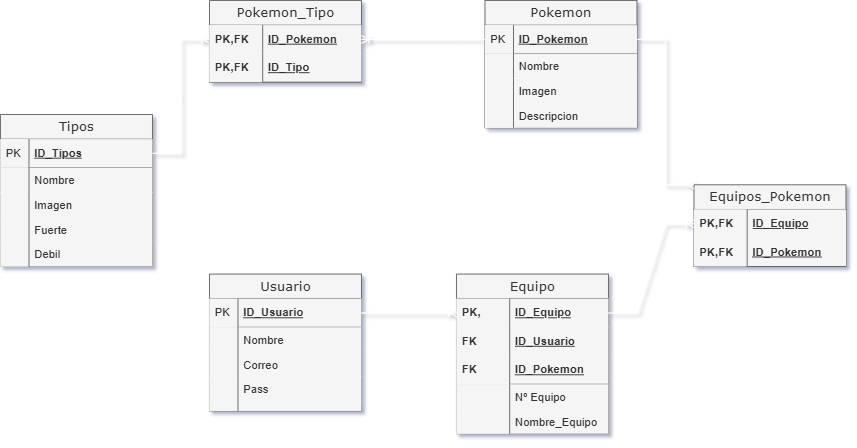
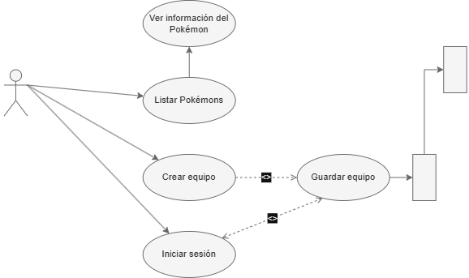

# TFG
Repositorio del TFG creado por Yesua Ibañez Castrillo

# ✏️ Título
**PokeStrategy** 
*Nombre provisional*

## 🔎 Objetivos  
- Implementar un sistema de autenticación de usuarios utilizando **Symfony** como backend.  
- Desarrollar un **frontend en Angular** que permita a los usuarios registrarse, iniciar sesión y visualizar Pokémon.  
- Usar **MySQL** como BBDD para almacenar a los usuarios.  
- Realizar llamadas a la **PokeAPI** para cargar la información deseada.  

## 📝 Temática  
Este proyecto permite a los usuarios:  
1. **Registrarse e iniciar sesión** con credenciales almacenadas en una base de datos gestionada por Symfony.  
2. **Visualizar una lista de Pokémon** obtenida desde la PokeAPI.  
3. **Proteger rutas y recursos** utilizando autenticación. 

## 🔨 Tecnologías utilizadas  
### **Backend (Symfony)**
- **Symfony** - Framework PHP para el backend.   
- **MySQL** - Base de datos para almacenar usuarios.  
- **PokeAPI** - API pública para obtener información de Pokémon.  

### **Frontend (Angular)**
- **Angular** - Framework de frontend para la interfaz de usuario.  
- **TypeScript** - Lenguaje de programación para Angular.  
- **Tailwind CSS / SASS** - Para el diseño y estilizado.  

***Informacion con posibilidad de cambios***

# 🖥️ Modelo E/R

# 🙍‍♂️ Casos de uso
